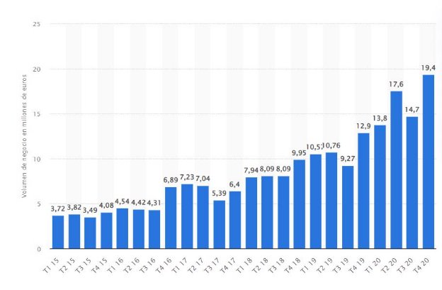
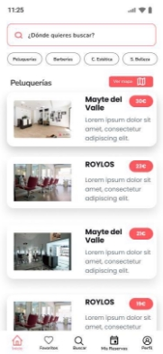
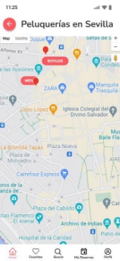
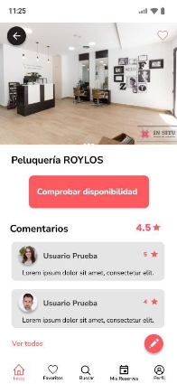
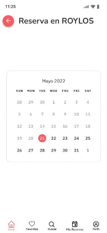
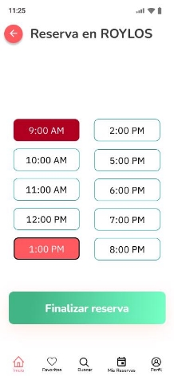
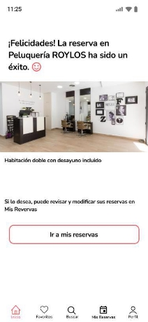
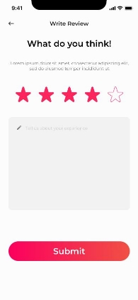

**Proyecto Final de Grado**

**D.A.M**

**Realizado por: Ernesto Fatuarte Fernández** 

**INDICE**

1. **Introducción** 
1. **Plan de Empresa** 
    1. Justificación del proyecto MySalon 
    1. Explicación del nombre y logo de la aplicación 
    1. ¿Qué ofrece la aplicación MySalon? 
    1. Modelo de negocio 
    1. Consumidores y posibles clientes 
    1. Competencia 
    1. Análisis DAFO 
    1. Publicidad y promoción de la aplicación 
3. **Futuras mejoras**
    1. API 
    1. App Móvil 
    1. Dashboard 
4. **Distribución del proyecto** 
    1. API 
    1. App Móvil 
    1. Dashboard 

**Introducción** 

Desde que existe la profesión, los peluqueros y los barberos han tendido a trabajar en pequeños negocios, o simplemente han trabajado por cuenta ajena, ofreciendo sus dotes al pueblo o esperando a que alguien contratase sus servicios. 

Desde hace ya algunos años, estos sectores se han ido profesionalizando cada vez más, aumentando progresivamente el nivel de negocios de este tipo, llegándose a formar auténticas franquicias a las que  los  clientes  suelen  acudir.  Aunque  los  pequeños  negocios  de  barrio  siempre  han  seguido existiendo.  

Y es en este tipo de negocios en los que se basa este proyecto, dado que, con el paso del tiempo y la inclusión de las nuevas tecnologías, las comodidades que ofrecen dichas tecnologías han propiciado que cada vez hagamos más gestiones de manera telemática. 

La  motivación  de  este  proyecto  nace  de  las  vivencias  personales,  de  familiares  y  de personas cercanas que, en su mayoría, para coger cita en su peluquería, barbería o centro de belleza habitual, deben  llamar  al  negocio,  ocasionando  en  muchas  ocasiones  un  tiempo  de  espera  o  repetidas llamadas, causadas por la carga de trabajo de los trabajadores del centro. 

Es  por  ello  que  nuestra  aplicación  buscará  facilitar,  en  la  medida  de  lo  posible,  este  tipo  de gestiones, ayudando al mismo tiempo al pequeño negocio, eliminando los libros de citas, más típicos del siglo pasado.  

Todo esto se llevará a cabo a través de una interfaz limpia y usable para el usuario, el cual podrá realizar otras tareas más allá de agendar una cita, como consultar los negocios cercanos a su zona, editar la hora de una cita o directamente cancelar su cita. Además, tendrá la opción de consultar las reseñas de los locales, ofreciendo al cliente todas las herramientas para que su elección siempre sea la mejor posible. 

Por otro lado, se le ofrecerá al propietario del negocio una aplicación web de gestión, a través de la cual se podrá revisar todo lo relevante al centro que regenta. Entre las opciones que se le ofrecerán se encuentran la posibilidad de gestionar las citas, pudiendo eliminar o editar las mismas. También podrá editar los servicios que ofrece al cliente, así como gestionar los comentarios que reciba su negocio. 

**Plan de Empresa** 

**Justificación del proyecto MySalon** 

MySalon  es  una  aplicación  móvil  que  pretende  facilitar  la  búsqueda  y  gestión  de  citas  en peluquerías, barberías y centros de estética a nivel nacional. 

No existe un prototipo de cliente ideal para esta aplicación, ya que cada vez más hombres acuden a centros de estética y/o barberías para cuidar su imagen, llegando a casi igualar en número de citas al sector femenino. Según los datos sectoriales, el ritmo de crecimiento de peluquerías, barberías y centros de belleza es de un 2%. Por tanto, nos encontramos ante un mercado en ligero crecimiento. 

Dada la importancia que los productos de cuidados higiénicos han tomado en nuestro día a día MySalon llevará a cabo tres estrategias de promoción principales: asistencia a ferias comerciales, partnerships con productores complementarios y publicidad digital. 

La  investigación  de  mercado  realizada  mostró  que [ España  es  el  país  del  mundo  con  más peluquerías,  barberías  y  centros  de  belleza.](https://www.elconfidencial.com/economia/2018-12-08/peluquerias-peluqueros-salones-belleza-estetica_1679734/)  Aproximadamente  hay  1  peluquería  por  cada  900 habitantes, lo que supuso que, por ejemplo, entre Octubre y Diciembre de 2020, el valor de las transacciones con origen y destino en España del sector de peluquerías y tratamientos de belleza se aproximó a los 20 millones de euros, cifra que supuso un incremento de cerca de cinco millones de euros con respecto al tercer trimestre de ese mismo año. 

A continuación se detalla el[ volumen de negocio del sector estético dentro de España ](https://www.aquora.es/blog/el-negocio-de-las-peluquerias-y-los-centros-de-estetica-supera-los-3-500-millones-de-euros/)de peluquería y tratamientos de belleza del primer trimestre de 2015 al cuarto trimestre de 2020: 

**Explicación del nombre y logo de la aplicación** 

El nombre de la aplicación se basa en la palabra inglesa Salon, el cual se utiliza para indicar el lugar en el cual se ofrecen diferentes tipos de servicios, como pueden ser de estética, peluquería o cuidado personal de manera general. 

Por otro lado, el logo es una clara referencia a los clásicos utensilios que se utilizan en peluquería. Se intenta ofrecer con el diseño del logo un estilo simple y ligero, en armonía con la experiencia de la aplicación. 

**¿Qué ofrece la aplicación MySalon?** 

`El uso principal de MySalon se basa en la gestión de citas en locales de cuidado personal, por lo que la pantalla  principal  de  la aplicación  mostrará  un  listado de todos los  centros  existentes  en  la aplicación, pudiendo el cliente buscar su ciudad para localizar los centros más cercanos a su zona. Además,  podrá  filtrar  por  el  tipo  de  centro  que  desee  buscar  haciendo  uso  de  unas  tarjetas implementadas bajo el buscador. 

`Además, para mayor precisión a la hora de buscar en una ciudad, el cliente dispondrá de un mapa interactivo, a través del cual podrá visualizar los negocios cercanos a su zona. 

`Como podemos ver, la navegación consistirá en un menú en la zona inferior de la pantalla, a través del cual podremos acceder a las diferentes pantallas de la aplicación, como son los centros favoritos, el buscador, la pantalla de consulta de citas pendientes o nuestro perfil. 

`Una vez estemos en la pantalla principal, si seleccionamos uno de los locales, entraremos en la página de detalles de dicho centro, en la cual podremos ver una información más detallada sobre el negocio,  pudiendo  además  ver  los  diferentes  comentarios  que  tiene  o  comprobar  las  horas disponibles para coger cita. 

`Una vez entremos a ver la disponibilidad de cita nos encontraremos con un calendario, el cual, pinchando en cada día, podremos comprobar las diferentes horas que se encuentren disponibles a lo largo de ese día. 

`Una vez finalicemos nuestra reserva, se nos mostrará una pantalla de confirmación, desde donde podremos acceder a nuestras reservas. 

`Además, una vez haya pasado nuestra hora de la reserva, se nos ofrecerá la posibilidad de realizar un comentario en el perfil del local que hayamos visitado, pudiendo incluir una imagen o vídeo del resultado y una valoración general de nuestra experiencia. 

**Modelo de negocio** 

Se han pensado tres estrategias para la obtención de beneficios a través de la aplicación: 

La estrategia principal consiste en establecer un porcentaje de los beneficios de los servicios que se le ofrecen al cliente como compensación por facilitar ciertos trámites con el uso de la aplicación. 

La siguiente estrategia consiste en un bono “dorado” durante un periodo de tiempo. Este bono se conseguirá abonando una cantidad de dinero, estableciendo al establecimiento que lo consuma un periodo,  el  cual  aumentará en  relación a  la  cantidad  abonada,  en el  cual aparecerá en  primera posición en las búsquedas, además de la posibilidad de crear su propio anuncio para que aparezca en la aplicación.  

Por último, en el lado de la aplicación móvil se introducirán anuncios de los establecimientos que decidan hacer uso de un modo “premium”, los cuales podrán eliminarse si se paga una pequeña cantidad de dinero. 

**Consumidores y posibles clientes** 

Como se indicó al comienzo, no existe un prototipo de cliente ideal para esta aplicación, ya que cada vez más hombres acuden a centros de estética y/o barberías para cuidar su imagen, llegando a casi  igualar  en  número  de  citas  al  sector  femenino.  Según  los  datos  sectoriales,  el  ritmo  de crecimiento de peluquerías, barberías y centros de belleza es de un 2%. Por tanto, nos encontramos ante un mercado en ligero crecimiento. 

Además, por un motivo lógico, la aplicación de gestión está pensada para que los propietarios de los negocios hagan uso de ella, pudiendo añadir nuevos servicios, gestionar las citas, etc. 

**Competencia** 

Tras las búsquedas realizadas tanto en la AppStore como en la PlayStore, no tenemos constancia de una aplicación que englobe diferentes locales de esta índole, únicamente se han encontrado aplicaciones para peluquería y negocios particulares. 

**Análisis DAFO** 

|**DAFO**|**Positivo** |**Negativo** |
| - | - | - |
|**Interno** |
**Fortalezas** 

- Conocimiento del perfil de cliente. 

- Educación en desarrollo de aplicaciones móviles 

- Bien conectado en la industria para partenariados y clientes distribuidores. 
|
**Debilidades** 

- Poco conocimiento sobre la industria de la estética. 

- Poca disponibilidad horaria para asistir a ferias, congresos, etc. 

- Falta de personal para gestionar marketing, RRHH… 
|
|**Externo** |
**Oportunidades** 

- Crecimiento sostenido del mercado de la estética. 

- Gran crecimiento en el sexo masculino. 

- Inexistencia de una aplicación similar. 
|
**Amenazas** 

- Mercado muy cambiante, ya que depende de las modas, lo cual puede suponer cambios constantes en la aplicación. 

- Economía sumergida por parte de peluqueros particulares. 
|

**Publicidad y promoción de la aplicación** 

MySalon se basará en tres estrategias de promoción de sus productos: 

- Dada  la  experiencia  de  un  familiar  que  trabaja  en  el  sector,  se  han  identificado  tres  ferias comerciales que son rentables para darse a conocer entre los jugadores de la industria. Dichas ferias son: 
  - Expobelleza 
  - Salon Look International 
  - Andalucía Belleza y Moda 
- Además, también conoce a varios comercializadores de productos complementarios con los que realizar partnerships, como son Collados Distribuidores, Captain Cook y Esencias de Luna 
- Finalmente, se utilizarán anuncios de Facebook e Instagram para llegar a los clientes ideales de nuestra aplicación. 

**Futuras mejoras** 

MySalon  es  una  aplicación  móvil  que  pretende  facilitar  la  búsqueda  y  gestión  de  citas  en peluquerías, barberías y centros de estética a nivel nacional. 

Para llegar a este objetivo se han pensado realizar una serie de mejoras en el futuro, como pueden ser: 

**API** 

- Creación de una clase ‘Servicios’, la cual se relacione con el negocio, permitiendo, a través de la duración del servicio que reserve el cliente, establecer de un modo más preciso el rango de horas de una cita. 

**App Móvil** 

- Implementación de un mapa de búsqueda, en el cual se localicen los negocios más cercanos a una ubicación dada. 
- Implementación de otros filtros, como la búsqueda por valoraciones, tipo de negocio o código postal. 
- Visualización de una lista con los comentarios realizados por el cliente. 
- Modificación de los formularios para registrar una cita, mostrando tarjetas de diferentes estados según la hora esté disponible o no. 
- Modificación  del  campo  de  valoración  en  el  formulario  de  creación  de  comentarios, mostrando dicho campo como una serie de estrellas, las cuales el usuario seleccionará en función de la satisfacción del servicio. 

**Dashboard** 

- Creación de una nueva pantalla home para cuando el usuario logueado sea un propietario, donde  se  muestre  una  cuadrícula  con  los  diferentes  negocios  que  posee,  pudiendo administrar las citas y comentarios existentes una vez entre en dicho negocio. 

**Distribución del proyecto** 

MySalon  cuenta  con  3  patas  principales,  cada  una  con  una  gestión  de  directorios  y  ficheros diferentes, la cual procederemos a explicar a continuación: 

**API** 

En la API, nos centraremos en la carpeta Main, que es la que contiene el código del proyecto. 

- **awss3**: Carpeta destinada a gestionar la configuración del servidor de Amazon en el cual se almacenan los ficheros multimedia. 
- **config**:  En  esta  carpeta,  como  su  propio  nombre  indica,  encontraremos  ficheros  de configuración, como la de CORS o la del servidor de Amazon en el cual se encuentra subida la base de datos y la API. 
- **controllers**:  En  este  directorio  tendremos  las  clases  controladoras  de  cada  entidad  del proyecto, dentro de las cuales definiremos los diferentes endpoints de nuestra aplicación. 
- **dtos**: En esta carpeta encontraremos las DTOs, las cuales nos facilitarán la devolución de datos, permitiendo únicamente devolver los datos estrictamente necesarios para cada situación. 
- **Errores**: En dicho directorio se gestionan los diferentes errores que puedan surgir a la hora de realizar peticiones a los diferentes endpoints de nuestra API. 
- **models**: En esta carpeta encontramos la definición de los modelos de nuestra aplicación, así como la definición de los atributos de cada una y las relaciones existentes entre ellas. 
- **repositories**: En este directorio encontramos las clases de repositorio pertenecientes a cada modelo de datso, dentro de las cuales podremos encontrar diferentes consultas a la base de datos, con el fin de obtener mejores relaciones de datos para mostrar. 
- **security**: En este directorio encontraremos las diferentes clases que gestionan la seguridad de nuestro proyecto, como la configuración del token JWT o los controladores del login. 
- **services**: En este directorio se encuentran los diferentes servicios relacionados con cada uno de  los  modelos  existentes  en  nuestra  API,  en  los  cuales  definiremos  las  lógicas  de  datos principales que tendrá nuestra aplicación, como la visualización de listas, la edición de datos, o la agregación de objetos a la base de datos. 
- **validation**: En esta carpeta encontramos las diferentes clases que utilizaremos para validar nuestros modelos de datos, como pueden ser la comprobación de igualdad entre una contraseña y una contraseña de confirmación o la restricción de unicidad del nombre de usuario. 

**App Móvil** 

En la aplicación móvil, realizada con Flutter, nos centraremos en la carpeta lib, que es la que contiene el código del proyecto. 

- **blocs**: En esta carpeta encontraremos un bloc, es decir, el sistema de gestión de estados, de cada uno de nuestros modelos. Para cada bloc, tendremos una clase principal, otra de eventos y otra de estados. 
- **models**: En esta carpeta encontramos la definición de los modelos de nuestra aplicación, así como la definición de los atributos de cada una y las relaciones existentes entre ellas. 
- **repositories**: En este directorio encontramos las clases de repositorio pertenecientes a cada modelo de datos, dentro de las cuales podremos encontrar diferentes consultas a la base de datos, con el fin de obtener los resultados en formato json, el cual utilizaremos más adelante en las clases de visualización. 
- **ui**: En este directorio encontraremos las diferentes pantallas existentes en la aplicación. 
- **widgets**: En esta carpeta encontraremos también clases relacionadas con la visualización de los datos, aunque, por su utilidad, no forman una pantalla entera, si no que forma parte de una. 
- **assets**: En este directorio encontraremos todas las imágenes, iconos y fuentes utilizadas en el proyecto. 

**Dashboard** 

En la aplicación de escritorio, realizada con Angular, nos centraremos en la carpeta src, que es la que contiene el código del proyecto. 

- **app**: Esta es la carpeta principal, ya que contiene el código del proyecto, conteniendo ésta a su vez diferentes directorios que merecen la pena nombrar: 
  - **components**: En esta carpeta encontraremos todos los elementos relacionados con la visualización de nuestra aplicación, como pueden ser los elementos compartidos ( como el toolbar), diálogos o las pantallas. 

    Cada  componente  consta  de  3  ficheros,  uno  con  extensión  .css,  que  será  donde establezcamos los efectos del componente en cuestión, la carpeta html, en la cual irá el código de la pantalla o elemento que queramos mostrar y, por último, un fichero .ts, en el cual programaremos toda la lógica relacionada con dicho componente. 

    - **models**:  En  esta  carpeta  encontramos  la  definición  de  los  modelos  de  nuestra aplicación, así como la definición de los atributos de cada una y las relaciones existentes entre ellas. 

    - **modules**:  En  este  directorio  encontraremos  dos  ficheros,  uno  llamado  material- imports, en el cual se encuentran todas las importaciones de componentes de Angular Material, y otro fichero, llamado app-routing, en el cual se definen las diferentes rutas de nuestra aplicación, relacionando cada una de ellas con un componente. 
    - **services**:  En  este  directorio  encontramos  los  métodos  de  acceso  a  los  datos pertenecientes  a  cada  modelo,  dentro  de  las  cuales  podremos  encontrar  diferentes consultas a la base de datos, con el fin de obtener los resultados en formato json, el cual utilizaremos más adelante en las clases de visualización 
- **assets**: En este directorio encontraremos todas las imágenes, iconos y fuentes utilizadas en el proyecto. 
- **environments**: En este directorio encontramos las clases de repositorio pertenecientes a cada modelo de datos, dentro de las cuales podremos encontrar diferentes consultas a la base de datos, con el fin de obtener los resultados en formato json, el cual utilizaremos más adelante en las clases de visualización. 